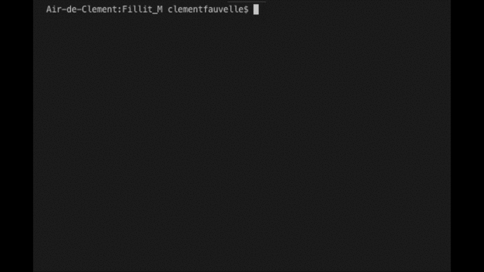

# FILLIT

 3rd C project for 42 school.

This programm will take a file as parameter, which contains a list of Tetriminos, and arrange them in order to create the smallest square possible.

(Group project carried out with [pommedepain](https://github.com/pommedepain))

## SUMMARY

- What is Fillit ?
- How to use it

## What is Fillit ?

- Fillit is a programms that parse a file, see if is valid and use backtracking to find the best solution possible to sorts the data contained in the file

- The expected files need to have a list of "tetriminos", separate by a white line. A tetriminos need to have 4 lines of 4 characters. It can only contains "." and "#".

- "." represents empty spaces.

- "#" represents one blocks of the tetriminos.

- A tetriminos is a classic piece of Tetris composed of 4 blocks. Each block of a tetriminos ust touch at least one other block of any of his 4 sides (up, down, left, right).

- For the result Tetriminos are ordered by they apparition order in the file. Among all the possible candidates for the smallest square, the one where Tetriminos are placed on their most upper-left position will be choosen.

- To identify each tetrimino in the square solution a capital letter is assign to each, starting with 'A' and increasing for each new terimino. ( So the maximum numbers of tetriminos in a file is 26).

- If a file is invalid the programm will returns "error" if no files are provided it will returns "usage: ./fillit file_descriptor" 

## How to use it

Run: `make`

Run: `./fillit ./examples/TEST_FILE_NAME`

**NB:** 
You have 3 example files:
- A little with 4 tetriminos
- A big with 26 tetriminos (the maximum)
- An invalid with bad tetrminos and indentation

